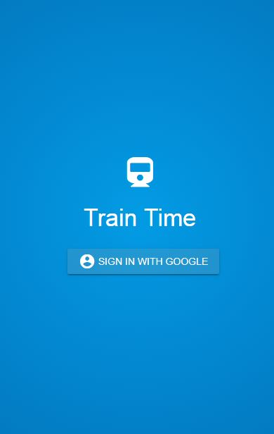
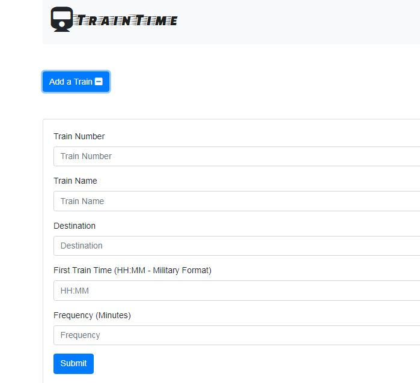

# Firebase Assignment - Train Scheduler

### Overview

TrainTime is a train schedule application that incorporates Firebase to host arrival and departure data.
The app retrieves and manipulates this information with Moment.js. 
This website will provide up-to-date information about various trains, namely their arrival times and how many minutes remain until they arrive at their station.

- - -

### Setup

Directory Structure:
```
─── TrainTime  (project root directory)
   ├── .firebase  (firebase stuff)
   ├── .git       (git stuff)
   ├── functions  (more firebase stuff)
   |      └── (node_modules) (node.js modules needed for deployment to firebase)
   └── public     (actual app artifacts)
         ├── assets
         |      └── css
         |      |    └── styling.css (css stylesheet)
         |      └── javascript
         |             └── logic.js (main program logic)
         ├── external
         |      └── jqueryui (needed for JQuery UI)
         ├── index.html (main html page)
         └── README.md  (this file)
```
The app uses HTML , Javascript , CSS, Jquery, JqueryUI, Firebase RT Database and some node.js modules needed for deployment to Google Firebase. 

### Application Use:

* The user must log in to the app by using their Google credentials.
* The user must click on the "Add Train" button to expand the train details area to input the train information . 
  
  * When adding trains, administrators will be able to submit the following:
    
    * Train Name
    
    * Destination 
    
    * First Train Time -- in military time
    
    * Frequency -- in minutes
  
  * The app calculates when the next train will arrive; relative to the current time.
  
  * Users from many different machines are also able to view same train times, by accessing the app URL from their browsers.
  

### Application Screen Shots

This is the initial splash page shown when the user reaches the app's URL.



After login, the main page is shown with the table displaying existing train details from the firebase real time database. 
Each train's arrival time as well as minutes to arrival is automatically updated every 30 seconds. 


By cliking the "Add a Train" button, the "Train Details" area is displayed, allowing the user to add information for a new train. After clicking the "Submit" button, the train record is added to the table.  The user can click the "Add a Train" button again to collaps the Train Details area. 




